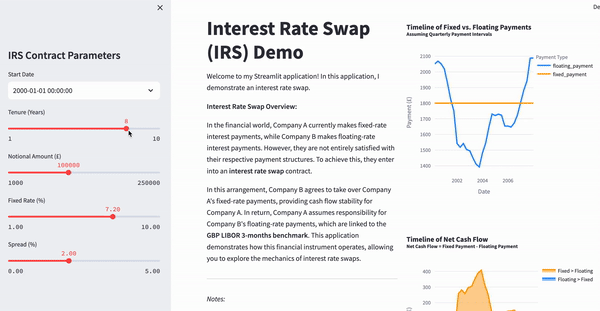

# Project Description. 

This repository offers a practical demonstration of interest rate swaps, which are financial instruments used to exchange fixed-rate and floating-rate interest payments. 

Explore the concept of Interest Rate Swaps by checking out the [Interest Rate Swap Demo](https://interest-rate-swap-demo.onrender.com)

Interest Rate Swap Demo (Preview):

Ideal for those seeking a concise insight into interest rate swaps.
